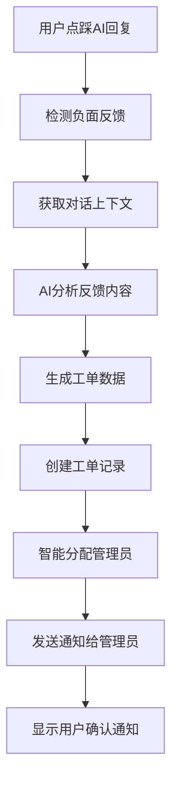

# AI自动工单生成系统

## 功能概述

本系统实现了当用户对AI回复进行点踩时，自动通过AI分析对话内容生成工单，并智能分配给合适的管理员进行处理。

## 核心功能

### 1. AI工单生成服务 (`ai_ticket_service.py`)

**功能**：
- 分析用户负面反馈和对话上下文
- 使用AI生成结构化的工单内容
- 自动确定工单优先级、分类和标签

**主要方法**：
- `generate_ticket_from_feedback()`: 根据反馈生成工单
- `_analyze_feedback_with_ai()`: 使用AI分析反馈内容
- `_get_chat_context()`: 获取对话上下文

### 2. 负面反馈检测 (`evaluations.py`)

**功能**：
- 检测用户点踩操作（评分为-1或0）
- 识别评论中的负面关键词
- 触发自动工单生成流程

**检测规则**：
- 评分反馈：评分为负数或0
- 文本反馈：包含负面关键词（如"不好"、"错误"、"bug"等）

### 3. 工单模型扩展 (`tickets.py`)

**新增字段**：
- `is_ai_generated`: 标识是否为AI生成的工单
- `source_feedback_id`: 触发工单的反馈ID
- `ai_analysis`: AI分析数据

### 4. 智能工单派发 (`ticket_assignment_service.py`)

**功能**：
- 根据工单分类和优先级智能分配管理员
- 考虑管理员工作负载和专业领域
- 支持基于用户组的分配规则

**分配策略**：
- Bug报告 → 技术开发团队
- 技术支持 → 技术支持团队
- 功能请求 → 产品团队
- 一般咨询 → 客服团队

**评分算法**：
- 角色匹配分数
- 在线状态分数
- 工作负载分数
- 专业领域匹配分数
- 优先级权重调整

### 5. 前端用户通知

**功能**：
- 用户点踩后显示友好的通知消息
- 告知用户工单已自动创建
- 引导用户查看工单处理进度

## 技术架构

### 后端组件

1. **AI工单服务** (`ai_ticket_service.py`)
   - 使用OpenAI API分析反馈
   - 生成结构化工单数据
   - 集成工单创建和分配流程

2. **工单派发服务** (`ticket_assignment_service.py`)
   - 智能管理员选择算法
   - 工作负载均衡
   - 专业领域匹配

3. **反馈处理增强** (`evaluations.py`)
   - 负面反馈检测
   - 自动触发工单生成
   - 异步处理流程

4. **数据模型扩展** (`tickets.py`)
   - AI生成工单标识
   - 反馈关联字段
   - 分析数据存储

### 前端组件

1. **用户反馈界面** (`ResponseMessage.svelte`)
   - 点踩按钮增强
   - 用户友好通知
   - 工单创建确认

## 工作流程



## 配置说明

### AI分析提示词

系统使用专门设计的提示词来指导AI分析用户反馈：

```
你是一个专业的客服工单分析助手。你的任务是根据用户的负面反馈和对话内容，自动生成结构化的工单。

请分析以下信息：
1. 用户的问题描述
2. 对话上下文
3. AI回复内容
4. 用户反馈的具体问题

基于分析结果，生成一个工单，包含：
- 标题：简洁明确的问题描述
- 描述：详细的问题分析，包括问题类型、影响范围、建议解决方案
- 优先级：low/medium/high/urgent
- 分类：bug/feature_request/general_inquiry/technical_support/other
- 标签：相关关键词
```

### 工单分类规则

| 分类 | 分配目标 | 优先级 |
|------|----------|--------|
| Bug报告 | 技术开发团队 | 高 |
| 技术支持 | 技术支持团队 | 中 |
| 功能请求 | 产品团队 | 中 |
| 一般咨询 | 客服团队 | 低 |
| 其他 | 管理员 | 中 |

## API接口

### 新增接口

1. **工单统计增强** (`GET /api/tickets/stats/summary`)
   - 包含AI生成工单统计
   - 按状态分类统计

2. **工单分配统计** (`GET /api/tickets/stats/assignment`)
   - 管理员工作负载统计
   - 分配效果分析

## 使用说明

### 用户操作

1. 用户与AI对话
2. 对不满意的回复点击点踩按钮
3. 系统自动检测负面反馈
4. 显示工单创建确认通知
5. 用户可在工单页面查看处理进度

### 管理员操作

1. 接收工单分配通知
2. 在工单管理界面处理工单
3. 查看AI分析结果
4. 更新工单状态和解决方案

## 监控和统计

### 关键指标

- AI生成工单数量
- 工单分配成功率
- 管理员响应时间
- 用户满意度提升

### 统计面板

管理员可在工单统计页面查看：
- AI生成工单占比
- 各分类工单分布
- 管理员工作负载
- 处理效率统计

## 扩展性

### 未来增强

1. **机器学习优化**
   - 基于历史数据优化分配算法
   - 预测工单处理时间
   - 自动优先级调整

2. **多语言支持**
   - 国际化负面关键词检测
   - 多语言AI分析提示

3. **高级分析**
   - 用户行为模式分析
   - AI回复质量趋势
   - 工单预测模型

## 注意事项

1. **隐私保护**：确保用户对话内容的安全处理
2. **性能优化**：AI分析可能耗时，需要异步处理
3. **错误处理**：AI服务不可用时的降级方案
4. **权限控制**：确保只有授权用户能访问工单数据

## 部署要求

- Python 3.8+
- FastAPI
- SQLAlchemy
- OpenAI API访问权限
- 管理员用户和用户组配置
